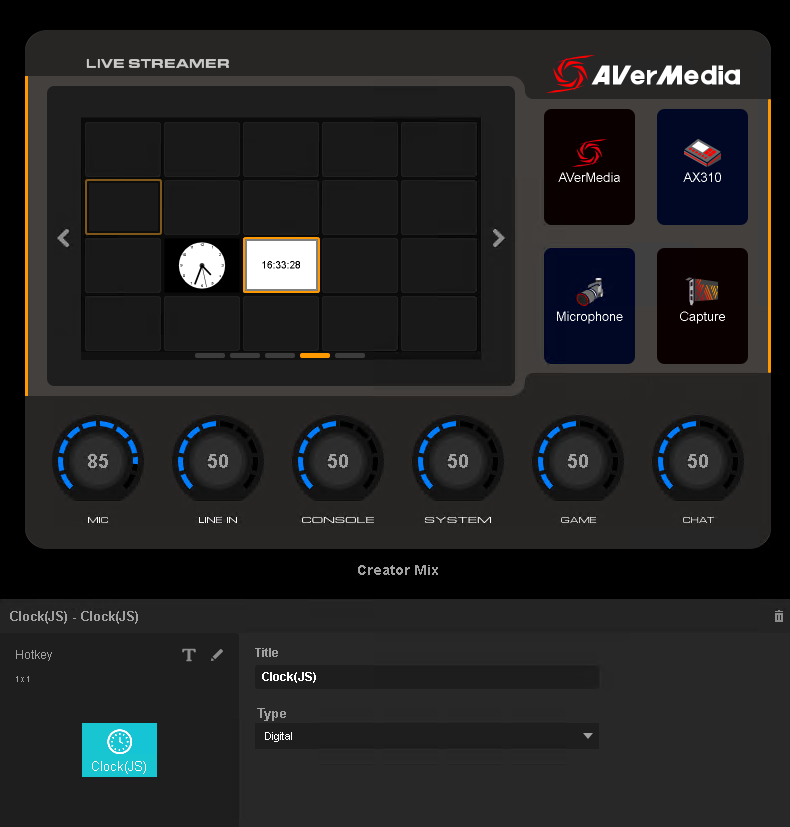

# JavaScript Widget sample for AVerMedia Creator Central

	

# Description
This is a clock widget that demonstrates how to write a JavaScript based widget for AVerMedia Creator Central. Creator Central uses open source Chromium based WebView to process your JavaScript/HTML/CSS. So most web developer should be able to make a JavaScript based widget very easily.

Some key components are listed here to help you better understand in developing your JavaScript based widget.

| File Name                                                                     | Descriptions                                                                                                                                                |
|-------------------------------------------------------------------------------|-------------------------------------------------------------------------------------------------------------------------------------------------------------|
| [PackageConfig.json](blob/main/Sources/Clock_js.widget_v2/PackageConfig.json) | Package configuration. Read [here](https://github.com/AVerMedia-Technologies-Inc/CreatorCentralSDK/blob/main/PackageConfiguration.md) for more information. |
| [ax_websocket.js](blob/main/Sources/Clock_js.widget_v2/js/ax_websocket.js)    | Basic WebSocket connection to be ready to communicate with Creator Central.                                                                                 |
| [avt.css](blob/main/Sources/Clock_js.widget_v2/css/avt.js)                    | Basic CSS stylesheet for Property page.                                                                                                                     |
| [widget.html](blob/main/Sources/Clock_js.widget_v2/widget.html)               | Widget main ui. But you won't see this html directly in Creator Central.                                                                                    |
| [property.html](blob/main/Sources/Clock_js.widget_v2/property.html)           | Widget configuration page. It will be shown in Creator Central Property View.                                                                               |

For more detail information about [Creator Central SDK](https://github.com/AVerMedia-Technologies-Inc/CreatorCentralSDK), please visit our [GitHub](https://github.com/AVerMedia-Technologies-Inc/) or [website](https://www.avermedia.com/gaming/creatorcentral).

# Installation
- Download [our prebuilt package](Release/Clock_js.widget_v2.creatorCentral) and use Creator Central Widget Import feature.
- You can compress your own widgets to a zip file and make the extension name as creatorCentral. Then you can import it to Creator Central.

# License
Copyright 2021-2022 AVerMedia Technologies Inc. and respective authors and developers.
This source code is licensed under the MIT-style license found in the [LICENSE](LICENSE) file.
